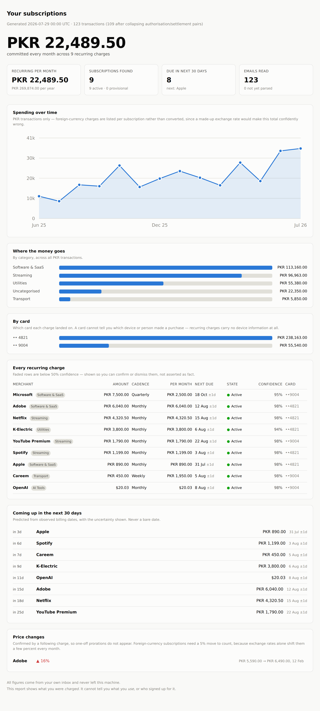

# Expense Tracker

**Find every subscription running on your card, from the emails you already have.**

A local-first desktop app for macOS and Windows. It reads your bank's transaction
alerts and the receipts subscription companies send you, works out what is
recurring, and tells you what you are actually paying for each month.

Your data never leaves your machine.



<sub>Screenshot uses invented demo data — `npm run seed-demo && npm run analyze -- --demo`. Never a real inbox.</sub>

---

## Why this exists

One card, several phones. Mine is loaded on my father's iPhone and my sister's
too. Subscriptions get signed up for across all of them, and there is no screen
anywhere that shows what is running against that card. Card statements are hard
to read, and App Store receipts are scattered across different Apple IDs.

But there is one place where every transaction shows up: my inbox. The bank
emails an alert for every charge, and every subscription company emails a
receipt. That inbox is the source of truth — it just isn't in a form you can
read.

This turns it into one.

---

## How it works

The inbox carries **two independent kinds of evidence**, and the useful part is
joining them:

|  | **Bank alert** | **Merchant receipt** |
|---|---|---|
| Authoritative for | money leaving the card | what the money bought |
| Tells you | amount, currency, card last-4, timestamp | plan name, billing period, next renewal, **which account the subscription belongs to** |
| Blind to | what the mangled merchant string means | which card paid |

A bank alert says `APPLE.COM/BILL 8002` charged PKR 4,320. The Apple receipt
says it was an iCloud plan under a particular Apple ID. Neither is much use
alone. Together they answer the actual question.

```
Gmail ──► parse ──► correlate ──► detect recurrence ──► dashboard
         (bank alerts +          (merchant + date,      (calendar-aware
          merchant receipts)      FX-tolerant)           cadence)
```

### Three things that turned out to be harder than expected

**Billing dates don't follow arithmetic.** A subscription anchored on the 31st
charges 31 Jan, 28 Feb, 31 Mar — gaps of 28 and 31 days. Averaging the gaps
reports "irregular" for one of the most regular patterns there is. Cadence is
inferred against a calendar instead, clamping day-of-month the way billing
systems do, with weekend shift absorbed as an explicit phase offset.

**Foreign subscriptions never match on amount.** The card is PKR; Netflix bills
USD. The bank says `PKR 4,320` and the receipt says `USD 15.49` for the same
charge, and the number moves 1–3% monthly on exchange rate alone. Correlation
keys on merchant and date, treats amount as corroboration only, and records the
implied FX rate — which incidentally shows you the card's FX markup.

**Banks send two emails per purchase.** An authorisation, then a settlement,
often for different amounts. Without collapsing those, every subscription looks
like it bills twice a month.

---

## What it deliberately does not claim

Being straight about this matters more than looking clever:

- **It cannot tell you *who* started a subscription.** Recurring charges are
  card-on-file, merchant-initiated transactions — they carry no device
  information at all. The app groups by card and reads the owning account off
  merchant receipts, and lets you tag a subscription to a person by hand. It
  will never guess that a charge came from your sister's phone.
- **It cannot tell you what you don't use.** It observes *charged*, never
  *used* — last login and watch history live outside your inbox. "Unused" is a
  tag you apply, shown with the annualised cost. Inferring it would produce
  confident wrong answers about services you use daily.
- **Annual subscriptions are the hardest to catch**, because confirming a yearly
  cadence needs three observations ≈ three years of retained mail. These are
  exactly the ones people most want to find, so they get a low-confidence
  single-observation heuristic, labelled clearly as a guess.
- **Your database is not encrypted at rest.** It relies on FileVault or
  BitLocker. Credentials *are* encrypted, in the OS keychain — see
  [SECURITY.md](SECURITY.md).

---

## Status

Under active development. The core is built and tested; the desktop UI is not
finished yet.

| | |
|---|---|
| ✅ Database, schema, migrations | working |
| ✅ Money and date parsing | working |
| ✅ Parse templates + security model | working |
| ✅ Gmail over IMAP | working |
| ✅ Subscription cadence detection | working |
| ✅ Analytics + dashboard | working |
| 🚧 Desktop UI | in progress |
| 📋 Gmail API (OAuth) | planned |

You can already point it at a real inbox from the command line — see
[docs/SETUP.md](docs/SETUP.md).

---

## Getting started

**Requirements:** Node.js 22.13 or newer, and a personal `@gmail.com` account
with 2-Step Verification enabled.

```bash
git clone https://github.com/msmurad21/expense-tracker.git
cd expense-tracker
npm install
npm run doctor        # checks your setup and explains anything missing
```

Then follow **[docs/SETUP.md](docs/SETUP.md)** to connect your inbox.

### Or let Claude do it

This repository is set up so that an AI coding agent can walk you through the
whole thing. Open the project in [Claude Code](https://claude.com/claude-code)
and say:

> set this up for me

It will check your Node version, install dependencies, walk you through creating
a Gmail App Password step by step, run the first sync, and write a parse template
for your specific bank by looking at one of your emails.

It will never ask you to paste your password into the chat — the app collects
that itself.

---

## Security

This app reads your email and records your financial history, so the design
takes a few deliberate positions:

- **Local-first.** No server, no telemetry, no analytics. The only outbound
  connections are to your own mail provider.
- **Parse templates are data, not code.** There is no `eval` anywhere in the
  parsing path. A template describes what to capture; a fixed evaluator does
  the capturing.
- **Templates are bound to DKIM-verified sender domains.** Anyone can email you
  while spoofing your bank's `From` header, so a template minted from genuinely
  signed bank mail will not fire on a forgery — or on an unsigned message at all.
- **Nothing parses until you approve it.** Every template, including the ones
  that ship with the app, shows you what it extracted before it is allowed to
  run.
- **Patterns are vetted before they are stored.** A regex like `(a+)+` takes
  hours on a 35-character subject line, and the process it would hang also owns
  the database. Those shapes are rejected structurally.

Full detail in [SECURITY.md](SECURITY.md).

---

## Contributing

The most useful contribution is **a parse template for a bank or service the app
doesn't know yet**. It is a small JSON-ish object, needs no knowledge of the rest
of the codebase, and immediately helps everyone with the same bank.

See [CONTRIBUTING.md](CONTRIBUTING.md).

Please never attach a real bank email to an issue or pull request — even a
redacted one. Redaction is easy to get wrong. Use a hand-written synthetic
sample like the ones in `tests/fixtures/`.

---

## Development

```bash
npm test                      # 179 tests
npm run typecheck
npm run sync -- --discover    # see who sends you money mail, writes nothing
npm run seed-demo             # invented data, written to a separate demo.db
npm run analyze -- --demo     # dashboard from that demo data
```

---

## Licence

[MIT](LICENSE)
